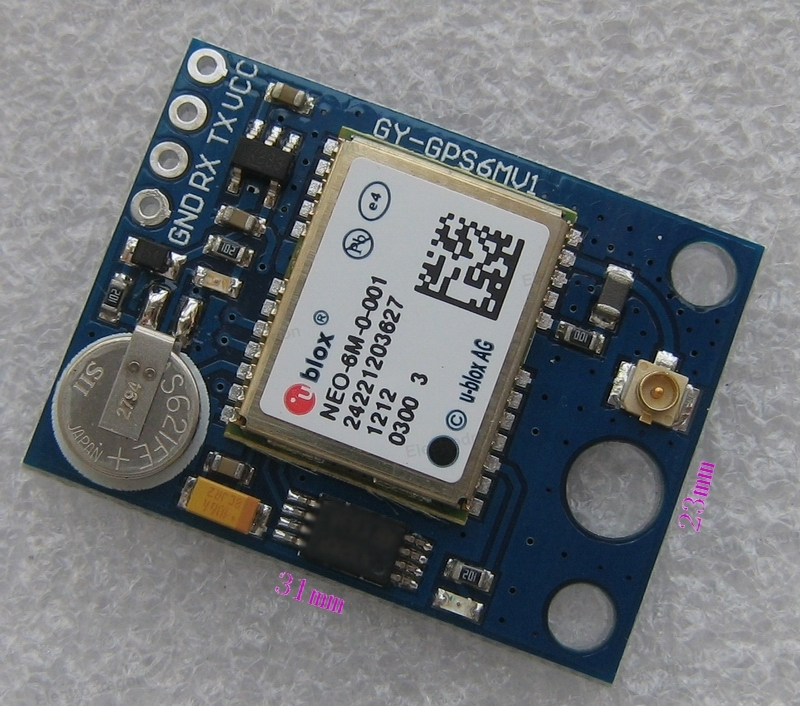

# Ublox_GPS

GPS is a godsend, these little recievers give position, time, speed, and many other datapoints which can be used in data logging and navigation systems

I read the NMEA sentences over serial using pySerial and parse them with the NMEA2 library. It is important not to reinvent the wheel when coding. Much thanks to the parser devs.

Qgis has a built in function to log points to the canvas over real time using this GPS. 

I hope to use it for a craft navigation system.

